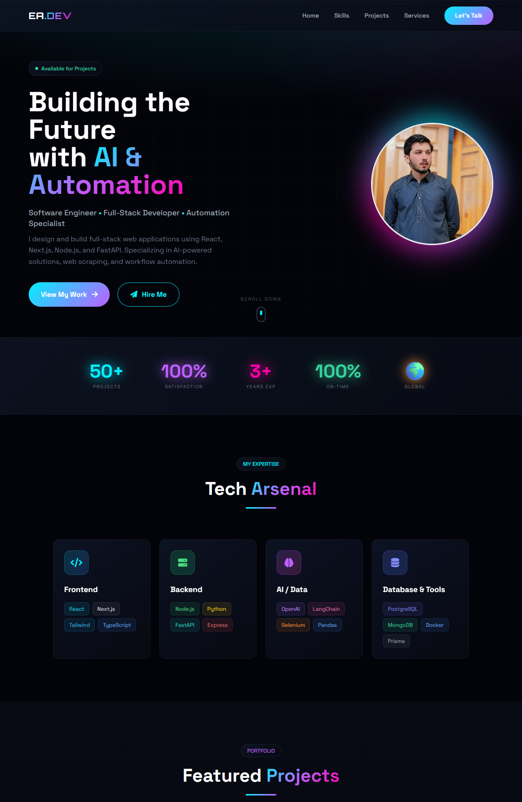



 

 

**🎯 You won't find this quality-to-price ratio anywhere else!**

 

---

## 🎯 Why Choose Me?

> ### *"Why hire two developers when one can do it all — faster, better, and at unbeatable value?"*

<table>
<tr>
<td width="50%" valign="top">

### 💼 What Sets Me Apart
| Feature | Benefit |
|---------|---------|
| 🤖 **AI-Powered Development** | 3x faster delivery with zero compromise on quality |
| 🎨 **Full-Stack Expertise** | From stunning UIs to robust backends |
| 📹 **Complete Transparency** | Video walkthroughs & detailed documentation |
| 🔄 **Iterative Approach** | Continuous feedback = Perfect results |
| 🛡️ **Production-Ready Code** | Scalable, secure, and maintainable |

</td>
<td width="50%" valign="top">

### 📊 Track Record

| Metric | Value |
|--------|-------|
| 🏆 Projects Delivered | **50+** |
| ⏱️ Years Experience | **3+** |
| ⭐ Client Satisfaction | **100%** |
| 🌍 Clients Worldwide | **Global** |
| 🚀 On-Time Delivery | **100%** |

</td>
</tr>
</table>

---

## 🛠️ Tech Arsenal

### Languages & Frameworks

### AI & Data

### Databases & Tools

---

## 🌐 My Live Portfolio

 

**🎨 AI-Powered Portfolio** | **💼 Full-Stack Showcase** | **🚀 Live & Interactive**

*Explore my work, projects, and services at my live portfolio website!*

---

## 🏆 Featured Projects

*Click on any project to explore the code!*

<table>
<tr>
<td width="50%">

### 🤖 [AI Portfolio Website](./ai-portfolio-nextjs)

Modern portfolio featuring stunning Framer Motion animations, glassmorphism design, dark/light themes, and responsive layout. Perfect showcase for developers.

`Next.js 14` `TypeScript` `Framer Motion` `Tailwind` `React`

</td>
<td width="50%">

### 💬 [Real-Time Chat App](./realtime-chat-app)

Full-featured chat platform with **Socket.IO** real-time messaging, multiple chat rooms, typing indicators, online status, and message persistence.

`Next.js` `Socket.IO` `Prisma` `Zustand` `TypeScript`

</td>
</tr>
<tr>
<td width="50%">

### 💼 [Job Board Platform](./job-board-platform)

Complete job marketplace with **admin dashboard**, employer portal, job seeker applications, analytics dashboard, and role-based access control.

`Next.js 14` `NextAuth` `Prisma` `Recharts` `PostgreSQL`

</td>
<td width="50%">

### 🔍 [Lead Scraper Dashboard](./lead-scraper-dashboard)

Intelligent Google Maps scraper with **stealth mode**, real-time Streamlit dashboard, email extraction, and export capabilities.

`Python` `Selenium` `Streamlit` `Pandas` `BeautifulSoup`

</td>
</tr>
<tr>
<td width="50%">

### 🛒 [E-Commerce API](./ecommerce-api)

Production-ready REST API with **JWT authentication**, product catalog, shopping cart, order management, and payment integration.

`FastAPI` `PostgreSQL` `Docker` `Redis` `SQLAlchemy`

</td>
<td width="50%">

### 📄 [Document Vision AI](./document-vision-ai)

AI-powered document extraction using **GPT-4 Vision** for automated processing of invoices, receipts, forms, and contracts.

`Python` `OpenAI` `FastAPI` `Tesseract` `Pillow`

</td>
</tr>
<tr>
<td width="50%">

### 🚀 [SaaS Landing Page](./saas-landing-page)

High-conversion landing page with modern UI, responsive design, smooth scroll animations, and optimized performance.

`React` `Vite` `Tailwind CSS` `Framer Motion`

</td>
<td width="50%">

### ✅ [Task Tracker MVP](./task-tracker-mvp)

Full-stack task management with **Kanban board**, drag-and-drop, team collaboration, real-time updates, and notifications.

`React` `Node.js` `MongoDB` `Express` `Socket.IO`

</td>
</tr>
</table>

---

## 🎓 Education

| 🏛️ | Institution | Degree |
|:---:|-------------|--------|
| 🎓 | **Virtual University of Pakistan** | Bachelor's in Software Engineering |

---

## 🤝 Let's Build Something Amazing!

### Ready to bring your ideas to life?

 

 

**📍 Pakistan (UTC+5) • 💬 English (Fluent) & Urdu (Native)**

 

### 🎯 Currently Open For:

`🔹 Full-time Remote` `🔹 Freelance Projects` `🔹 Contract Work` `🔹 Technical Consulting`

 

---

### ⚡ Quick Response Guaranteed!

*I typically respond within 2-4 hours during business hours*

 

**⭐ If you find my work valuable, a star would mean the world to me!**

---

